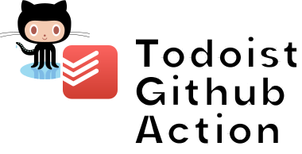

<div align="center">
  
  
  Synchronize Github tasks to Todoist with Github Actions!

[](https://www.tidyverse.org/lifecycle/#experimental)

</div>

**Do you love getting Karma points but feel adding all the tasks into Todoist
isn't worth it? Well, you're in luck. This Github Action synchronizes your
Github issues and tasks so you can get to the next karma level easy!**

Tools like Todoist is excellent for productivity, and now for developers too.
Being an active contributor to Github Actions, I feel an integration between
Github and Todoist is another ideal use-case. Run it periodically to get the
latest issues added to your todo list!

## Example

You can see a [running example in this repo][workflows].

```yml
- name: Sync issues
  id: sync
  uses: cobraz/todoist-action@v1
  with:
    github-token: ${{ secrets.GH_TOKEN }}
    todoist-token: ${{ secrets.TODOIST_TOKEN }}
    query:
      updated:>2020-06-01 archived:false sort:updated-desc assignee:cobraz
      -label:backlog
    sync-file-name: ./sync.json
```

## Configuration

The action can be configured with the following arguments:

- `github-token` (required) We need a **personal Github token** in order to use
  the Github API to get issues.

- `todoist-token` (required) In order to make authorized calls to the Todoist
  Sync API, we need a Todoist token. You can obtain your personal API token from
  the [integrations settings](https://todoist.com/prefs/integrations) for your
  account.

- `query` (required) The search for which you want issues / pull requests.
  You'll have to use [Githubs search syntax][search-syntax].

- `sync-file-name` (optional) Where to retrieve/store the synchronization data,
  read more about that below.

- `sync-content` (optional) Input for synchronization data, read more about that
  below.

## Synchronization Data

This Github Action needs a state, which you are free to choose which. You can
find an example in my [workflows][], where I use Github Gist to store the
synchronization data.

You can either use file storage or use Github Action input/output to communicate
with the Action. `sync-content` is an output of this Github Action; it contains
a JSON dump that you can store somewhere. Just make sure you send that same JSON
dump back as an input (`sync-content`).

If you want to use Amazon S3 or Google Storage, you can download and upload a
file (defined by `sync-file-name`).

## Known issues

This Github Action is still experimental; most of the synchronization operation
works (and you can see examples of it [used here][actions]). However, if you
complete a task in Todoist – the Github issue **will not** be closed. The action
also does not synchronize more issues than what is returned by the API (it does
not paginate).

## Contribute

Feel free to open an issue or pull request. The Todoist Action is still
experimental, help us get is stable! Feedback is much appreciated!

[workflows]: https://github.com/cobraz/todoist-action/blob/main/.github/workflows/schedule.yaml
[actions]: https://github.com/cobraz/todoist-action/actions
[search-syntax]:
  https://docs.github.com/en/github/searching-for-information-on-github/understanding-the-search-syntax
